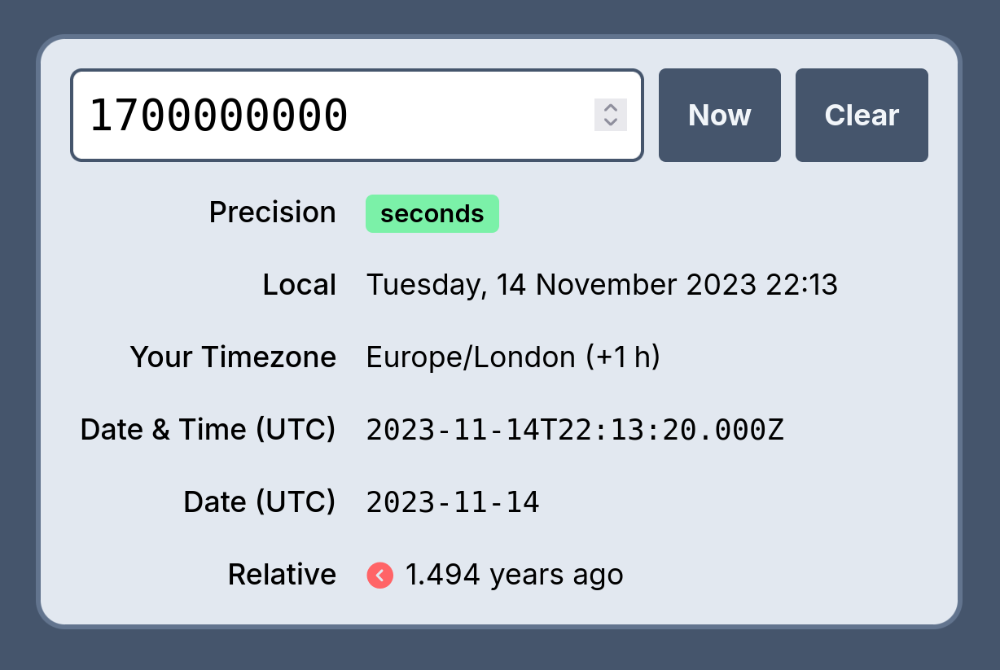

# 🕰️ Lightweight Unix timestamp converter

A tiny lil' web app that converts Unix timestamps to human-readable dates ready to copy and paste.

Available at **<https://unix.wjdp.uk>**

## Project template

This project uses the Vue/Vite template.

Learn more about the recommended Project Setup and IDE Support in the [Vue Docs TypeScript Guide](https://vuejs.org/guide/typescript/overview.html#project-setup).
